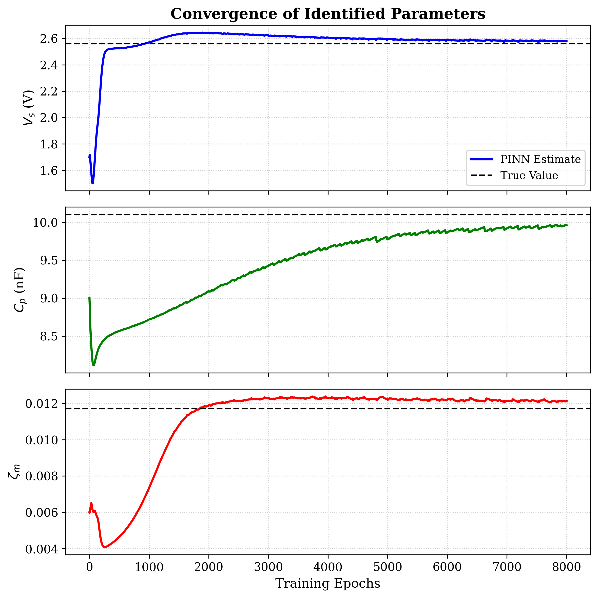
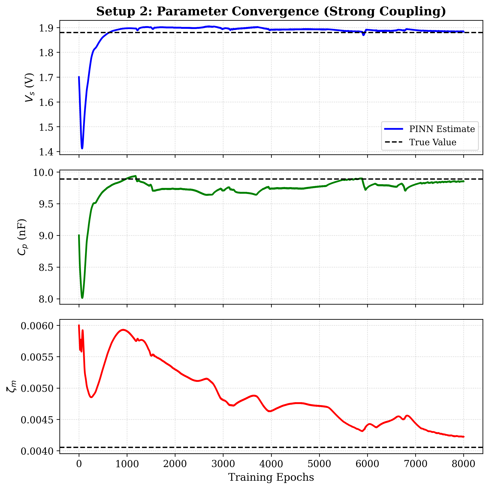

# Robust PINN for Piezoelectric Energy Harvesting

**Deep Learning for Inverse Parameter Identification in Coupled Electromechanical Systems**

This repository contains the code and methodology for reproducing the parametric identification of Piezoelectric Energy Harvesters (PEH) using Physics-Informed Neural Networks (PINNs). By embedding the 4th-order Runge-Kutta solver directly into the neural network's loss function, this model successfully identifies hidden physical constants from noisy experimental data without overfitting.

**Author:** Pushpavanam Hariharan Dhananjay  
**Institution:** Department of Electronics and Communication Engineering, IIITDM Kancheepuram  

---

## 📌 Project Objective
Identifying physical constants in harvester systems is critical for performance optimization. This project focuses on identifying three hidden parameters using only noisy voltage data:
* **Mechanical Damping (${\zeta_m}$):** Essential for energy decay modeling.
* **Voltage Source (${V_s}$):** Force magnitude divided by the piezoelectric constant.
* **Internal Capacitance (${C_p}$):** Key to electrical domain impedance.

## 🧮 Governing Physics
The 1-DOF electromechanical dynamics of the harvester are governed by coupled mechanical and electrical equations. To stabilize the Neural Network and prevent gradient explosions, these equations are non-dimensionalized.

**Final Dimensionless ODEs:**

$$\ddot{q}(\bar{t}) + 2\zeta_m\dot{q}(\bar{t}) + q(\bar{t}) + k_e^2V_p(\bar{t}) - V_sk_e^2f(\bar{t}) = 0$$

$$r\dot{q}(\bar{t}) - r\dot{V}_p(\bar{t}) - V_p(\bar{t}) = 0$$

*(Where $r = C_pR_L\omega_n$)*

### The Piezoelectric Stiffening Phenomenon
The mechanical stiffness of a piezoelectric beam is fundamentally altered by its electrical boundary conditions (the converse piezoelectric effect). We exploit this frequency shift to calculate the electromechanical coupling coefficient directly from experimental modal testing:

$$k_e^2 = \left( \frac{f_{oc}}{f_{sc}} \right)^2 - 1$$

## 🧠 PINN Architecture
The PINN acts as a functional mapping between dimensionless time and the system states while treating the hidden physical constants as learnable parameters.

* **Network Depth/Width:** 3 Hidden Layers, 10 Neurons per layer.
* **Activation Function:** Sine ($\sin(z)$) to match the periodic nature of harmonic vibrations.
* **Optimizer:** Adam.
* **Learnable Parameters:** $\bm{\lambda} = \{ \zeta_m, V_s, C_p \}$

### The Composite Loss Function
The network is trained on $N_D = 200$ sparse, noisy data points (simulating lab sensors with $1\text{mV}$ Gaussian noise) and constrained by a dense grid of $N_e = 500$ collocation points evaluating the exact ODE residuals via PyTorch Autograd.

$$\text{Loss} = w_{f_1}\mathcal{R}_{mech} + w_{f_2}\mathcal{R}_{elec} + w_e(V_p - V_p^*)^2$$

## 📊 Results

The model was tested under two different physical regimes to prove robustness and prevent data leakage.

### Setup 1: Weak Coupling ($k_e^2 = 0.05$)
Despite the realistic Gaussian noise ($\sigma^2 = 0.001$), the physics guardrails guided the optimizer to the true physical constants with an error margin well below 4%.

| Parameter | True Value (Fitting) | PINN Prediction | Relative Error |
| :--- | :--- | :--- | :--- |
| **$\zeta_m$** | 0.0117 | 0.0121 | 3.52 % |
| **$V_s$ (V)** | 2.560 | 2.579 | 0.76 % |
| **$C_p$ (nF)** | 10.10 | 9.961 | 1.37 % |

  
  
<i>Parameter convergence dynamics across 8,000 epochs for Setup 1.</i>

### Setup 2: Strong Coupling ($k_e^2 = 0.15$)
In a highly non-linear regime dominated by piezoelectric stiffening, the PINN achieved **sub-1% error** on the electrical parameters. Mechanical damping error remained under 5%, proving the architecture is highly robust across varying material properties.

| Parameter | True Value (Fitting) | PINN Prediction | Relative Error |
| :--- | :--- | :--- | :--- |
| **$\zeta_m$** | 0.00405 | 0.00422 | 4.18 % |
| **$V_s$ (V)** | 1.880 | 1.884 | 0.20 % |
| **$C_p$ (nF)** | 9.890 | 9.854 | 0.36 % |

  
  
<i>Parameter convergence dynamics across 8,000 epochs for Setup 2. Note the delayed stabilization of mechanical damping due to the dominant electrical feedback.</i>

## 🛠️ Justification for Dimensionality Reduction
While the original text utilized a 3-input broadband model $[\bar{t}, R_L, \omega]$, our reproduction optimizes the architecture to a 2-input resonant model $[\bar{t}, R_L]$. Because the target parameters are intrinsic constants ($\boldsymbol{\lambda} \neq f(\omega)$), fixing $\omega = \omega_n$ reduces input dimensionality, shrinking the hypothesis space and accelerating convergence without sacrificing physical fidelity.
