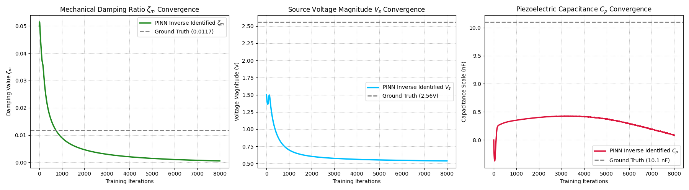

# Pinn---Learning---Log

## Overview
By completing Experiment:1, I have understood the basic structure of a Neural Network and a PINN Model. I have deeply understood the concept of Loss function and its difference in both a standard NN and a PINN Model. 

## Problem statement: 
The task is to estimate physical parameters like: 
- Damping conefficient
- Internal Coefficient of Piezoelectric Beam
- Source Voltage (Voltage equivalence of the Amplitude of the Force applied by Shaker)

## Model Architecture:
- Input: Dimensionless time
- Hidden Layers: 3 hidden layers with 10 neurons each
- Activation Fucntion: Sine Function
- Output: dimensionless distance (q) and output voltage (vp)

## Training Details: 
- Learning rate: 0.003
- Epochs: 8000

## Result:

The output parameters predicted have a large deviation from their actual value

### Please Note: The code has been generated with AI
